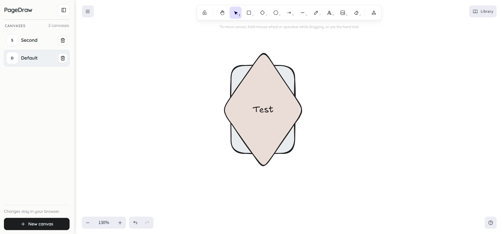

### LocalDraw

LocalDraw is a local-first drawing workspace built on top of Excalidraw. It gives you a simple way to manage multiple canvases in one place, switch between them quickly, and keep your work saved in the browser without needing a backend.




### Highlights
- **Multiple canvases**: create, rename, switch, and delete canvases from a single sidebar.
- **Local-first storage**: canvas data is stored in `localStorage`, so your work stays in the browser.
- **Autosave**: changes are saved automatically while you work.
- **Canvas state memory**: each canvas keeps its own content and viewport state.
- **Minimal workspace UI**: a collapsible, resizable sidebar keeps navigation simple.

### Tech stack
- React + TypeScript + Vite
- Excalidraw (`@excalidraw/excalidraw`)
- Local storage for persistence

### Getting started
1. Install dependencies:
   ```bash
   npm install
   ```
2. Start the dev server:
   ```bash
   npm run dev
   ```
3. Open the app at the URL printed in your terminal (typically `http://localhost:5173`).

### Notes
- LocalDraw does not sync to a server.
- Clearing browser storage will remove your saved designs.

### License
This project is licensed under the MIT License. See `LICENSE`.

This distribution includes Excalidraw, which is licensed under the MIT License. See `THIRD_PARTY_NOTICES.md` for the Excalidraw copyright and license notice.
